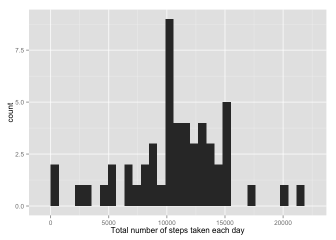
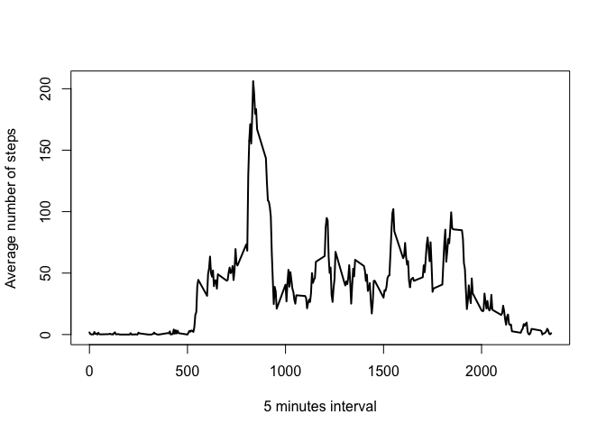
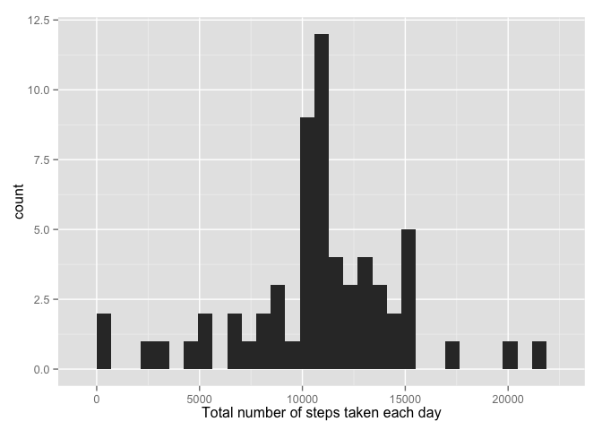

# Reproducible Research: Peer Assessment 1


## Loading and preprocessing the data

```r
library("dplyr")
library("lubridate")
activity <- read.csv(unz("activity.zip", "activity.csv")) %>% 
    tbl_df %>% 
    mutate(date = ymd(date))
```


## What is mean total number of steps taken per day?
\


```r
meanStepsPerDay <- as.integer(mean(totalStepsPerDay$total, na.rm = TRUE))
```

Mean steps per day: 10766


```r
medianStepsPerDay <- median(totalStepsPerDay$total, na.rm = TRUE)
```
Median steps per day: 10765


## What is the average daily activity pattern?

```r
meanStepsPerInterval <- activity %>% group_by(interval) %>% summarise(average = mean(steps, na.rm = TRUE)) 
with(meanStepsPerInterval, plot(interval, average, type = "l", xlab = "5 minutes interval", ylab = "Average number of steps", lwd = 2))
```

\


```r
maxStepInterval <- (meanStepsPerInterval %>% filter(average == max(meanStepsPerInterval$average)))$interval
```

Interval containing maximum number of steps: 835


## Imputing missing values

```r
totalMissingValues <- activity %>% filter(is.na(steps)) %>% nrow
```

Total number of missing values in the dataset: 2304


Fill missing steps with average per step per day:

```r
noNasTotalStepsPerDay <- activity %>% 
    group_by(date) %>% 
    summarise(total = sum(steps)) %>%
    mutate(total = ifelse(is.na(total), mean(total, na.rm = TRUE), total))
```


We can see that in this case, TODO

\


## Are there differences in activity patterns between weekdays and weekends?
