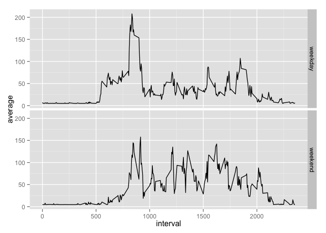

# Reproducible Research: Peer Assessment 1


## Loading and preprocessing the data

```r
library("dplyr")
library("lubridate")
activity <- read.csv(unz("activity.zip", "activity.csv")) %>% 
    tbl_df %>% 
    mutate(date = ymd(date))
```


## What is mean total number of steps taken per day?
\


```r
meanStepsPerDay <- as.integer(mean(totalStepsPerDay$total, na.rm = TRUE))
```

Mean steps per day: 10766


```r
medianStepsPerDay <- median(totalStepsPerDay$total, na.rm = TRUE)
```
Median steps per day: 10765


## What is the average daily activity pattern?

```r
meanStepsPerInterval <- activity %>% 
    group_by(interval) %>% 
    summarise(average = mean(steps, na.rm = TRUE)) 
with(
    meanStepsPerInterval, 
    plot(interval, average, type = "l", 
         xlab = "5 minutes interval", ylab = "Average number of steps", 
         lwd = 2))
```

\


```r
maxStepInterval <- (meanStepsPerInterval %>% 
        filter(average == max(meanStepsPerInterval$average)))$interval
```

Interval containing maximum number of steps: 835


## Imputing missing values

```r
totalMissingValues <- activity %>% filter(is.na(steps)) %>% nrow
```

Total number of missing values in the dataset: 2304


Fill missing steps with mean steps per interval:

```r
meanStepsPerInterval <-  mean(activity$steps, na.rm = TRUE)
noNasActivity <- activity %>% 
    mutate(steps = ifelse(is.na(steps), meanStepsPerInterval, steps))
```


We can see that in this case, replacing missing values with average significantly
increases the count in the histogram for mean value (as we could expect).

\


## Are there differences in activity patterns between weekdays and weekends?

We can see that activity is much more constant on weekends than during 
regular week days. One explanation for that could be that the test subject 
works in during regular days in a sitting position.


```r
library("ggplot2")
noNasActivityWithWeekDays <- noNasActivity %>% 
    mutate(dayType = as.factor(
        ifelse(weekdays(date) %in% c("Saturday", "Sunday"), "weekend", "weekday")
    ))
noNasMeanStepsPerInterval <- noNasActivityWithWeekDays %>% 
    group_by(dayType, interval) %>% 
    summarise(average = mean(steps)) 
ggplot(noNasMeanStepsPerInterval, aes(interval, average)) + 
    geom_line() +
    facet_grid(dayType ~ .)
```

\

